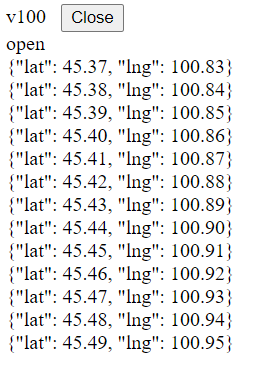

# WebSocket Real-time Tracker

This project is a WebSocket template that fetches data from MongoDB at regular intervals.

## Prerequisites
* Maven 3.6.0 or higher versions
* Java 11
* MongoDB 4.4.5 or higher versions

## Other frameworks
* WebSocket
* Spring Boot
* Spring
* Sping MVC

## How to run this project
1. Create a new MongoDB user. For convenience, you can refer to the next section [Steps to create a new MongoDB user](#steps-to-create-a-new-mongodb-user).
2. Clone this project in IntelliJ IDEA.
3. Edit `\src\main\resources\application.properties`: replace `spring.data.mongodb.username`, `spring.data.mongodb.password`, `spring.data.mongodb.database` and `spring.data.mongodb.authentication-database` with your own ones.
4. Run `\src\main\java\com\singfung\tracker\WebSocketRealTimeTrackerApplication.java`.
5. Add some samples to MongoDB by running `\api-samples\saveGPS.http`. It adds the GPS information of two vehicles into MongoDB (`v100` and `v101`).
6. Open three tabs in a browser(`http://localhost:8080/v100.html`, `http://localhost:8080/v101.html` and `http://localhost:8080/v102.html`). We could see that tab `v100` and tab `v101` would receive the GPS information of its own vehicle every 2 seconds, while `v102` could receive no data since its record is not found in MongoDB.

## Steps to create a new MongoDB user
1. Run cmd as Administrator, start MongoDB:
    1. execute `net start mongodb`;
    2. execute `mongo`. 
2. Use `admin` database and create a root user:
    1. execute `use admin`;
    2. execute `db.createUser({user:'root',pwd:'1234qwer',roles:[{role:'root',db:'admin'}]})`.
3. Close the current cmd and open a new one. Restart MongoDB by executing the following:
    1. `net stop mongodb`;
    2. `net start mongodb`.
4. In cmd go to `your-mongodb-directory/bin`, execute `mongod --auth` to enable authentication.
5. Enter `mongo`, then enter `use admin` to switch to `admin` database.
6. Enter `db.auth('root', '1234qwer')` to authenticate. It means success if it returns 1.
7. Create a new user in your database:
    1. `use your-database-name`
    2. `db.createUser({user:'your-username',pwd:'your-password',roles:[{role:'readWrite',db:'your-database-name'}]})`